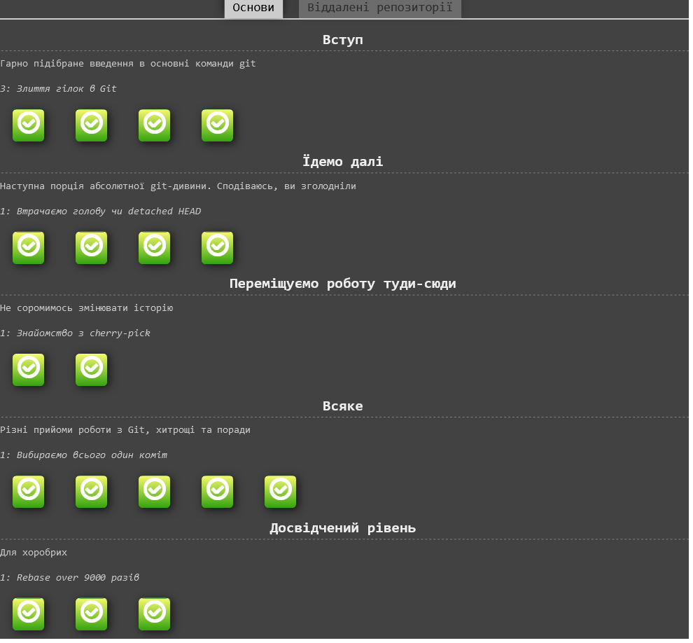

# Kottans-frontend (^:^)

# Stage 0.

## General
---
0. [x] [Git та GitHub](#git-basics)

1. [x] [Linux CLI and Networking](#linux-cli-and-http)

2. [x] [GitHub and Collaboration](#git-collaboration)

---
## Front-End Basics

3. [x] [Intro to HTML & CSS](#intro_html)
4. [ ] Responsive Web Design
5. [ ] HTML & CSS Practice
6. [ ] JavaScript Basics
7. [ ] Document Object Model - practice

---

## Git-basics

Я знайомий з GitHub давно але ніколи не здогадувався про такий гнучкий та широкий функціонал такої VSC перш за все було цікаво а як це слухати інформацію на англійській та виконувати таски, але так чи інакше мій рівень англійської ніби не підвів в практичній частині багато корисного для себе виніс та багато чого нового записав, відкритям для мене були fetch pull rebase, це такі най більш такі цікаві та функціональні команди, але "після смак" залишився такий приємний, хоч і було важко місцями)

### Сюди я кинув короткий звіт про зроблену роботу як і на coursera так і на learngitbranching)

  
Srcreenshots

  
  
  
  

  
  
  
  

  

---

## Linux CLI, and HTTP

В першу чергу хочу сказати що я не користувався ОС linux взагалі ніколи, але ця ОС мене зацікавила своїм функціоналом зокрема видалення друку (lprm) також df, aux та grep, також прочитав про протокол HTTP та HTTPS  багато корисної інформації яку не одразу запамятовуєш але основні моменти про передачу данних, по якому технічному протоколу вони передаються які є коди, заголовки повідомлень при роботі на Node.js або Ruby on Rails там був також якийсь спосіб забув(, а так в загальному для розуміння того як працює інтернет досить корисні статті 

### Сюди я кинув короткий звіт про зроблену роботу

  
Srcreenshots

  
  
  
  

1. [HTTP: Протокол, який повинен розуміти кожний веб-розробник - Частина 1](https://code.tutsplus.com/uk/tutorials/http-the-protocol-every-web-developer-must-know-part-1--net-31177)

1. [HTTP: Протокол, який повинен розуміти кожний веб-розробник - Частина 2](https://code.tutsplus.com/uk/tutorials/http-the-protocol-every-web-developer-must-know-part-2--net-31155)

---

## Git Collaboration

Цей розділ був таким завершуючим зерном в цьому лянцюжку знань, тобто коли на перших тижднях мене тільки знайомили з Git та GitHub то ці два тиждні дали чітке уявлення про те, як працювати з іншимм розробниками як мерджити гілки робити pull request, та які нюанси можуть виникати при роботі, також трішки послухав за GitLab  в цілому багато корисної інформації, в підсумку по роботі з гіт використовувати буду багато чого, тому, що це досить поширена VCS та у робочі моменти життя вона буде корисною як ніколи і багато команд для себе я запамятав які не запамятав то записав, але на увазі буду мати широкий функціонал даної VCS)

### Сюди я кинув короткий звіт про зроблену роботу

  
Srcreenshots

  
  
  

---

## Intro to HTML and CSS

Основи HTML та  CSS я знаю досить давно але було не погано освіжити ці знання та нагадати собі як що і де працює, також як стилізувати блоки і т.д якщо говорити коротко то якщо б я був новачком то частина з 1 та 2 неділею курсу та закріпивши практичну частину на codecademy то було б у мене був дуже хороший багаж знань)

### Сюди я кинув короткий звіт про зроблену роботу

  
Srcreenshots

  
  
  

